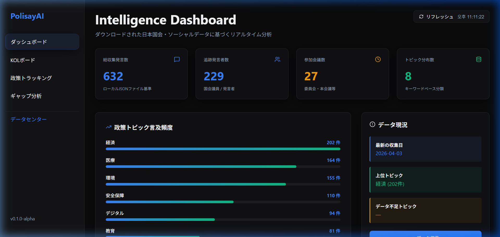
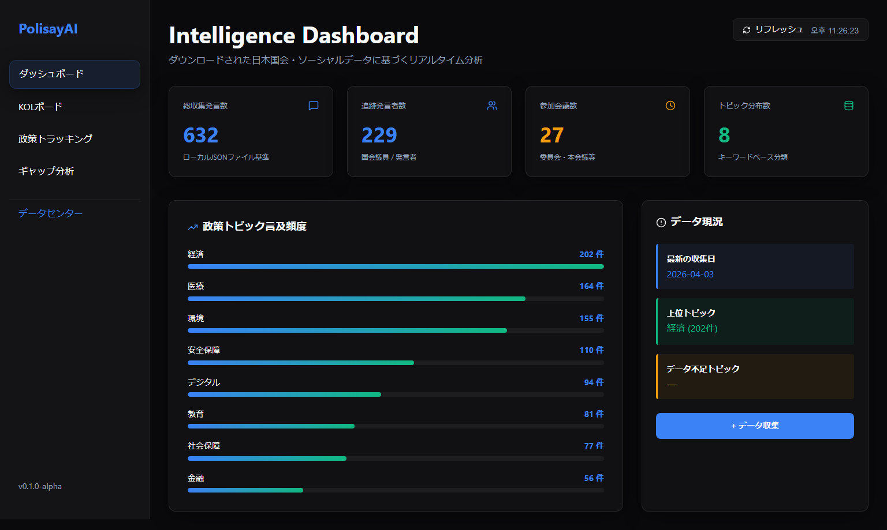
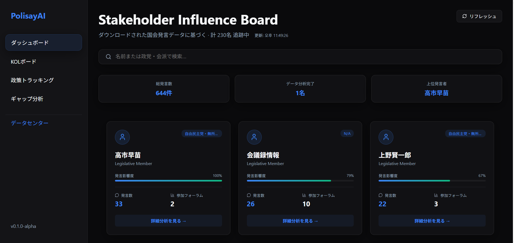
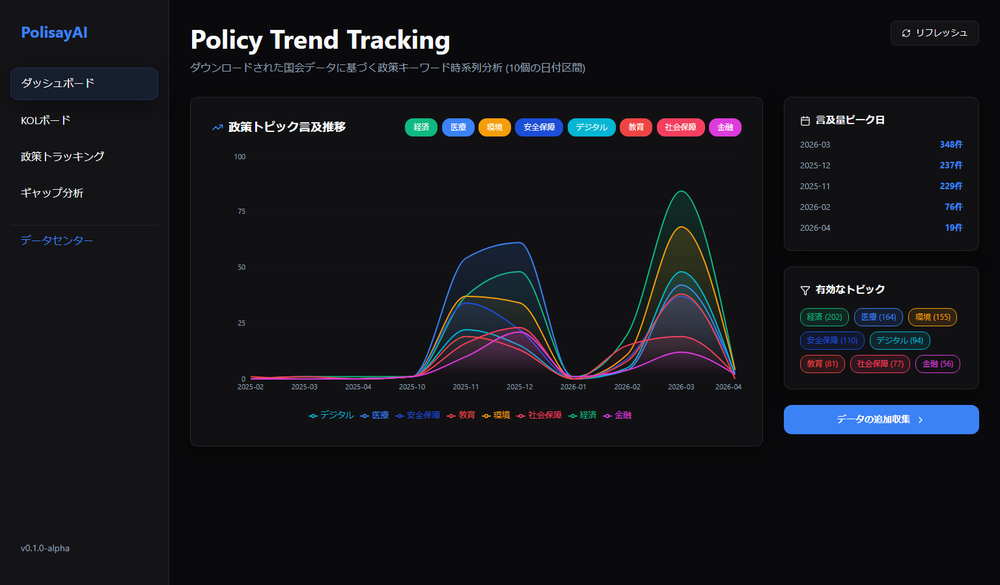
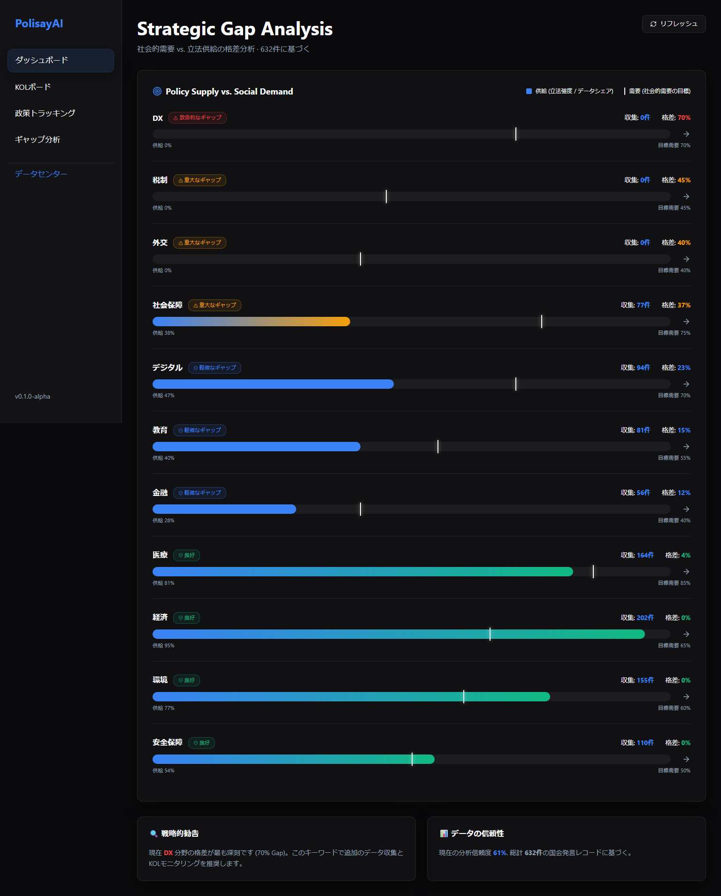
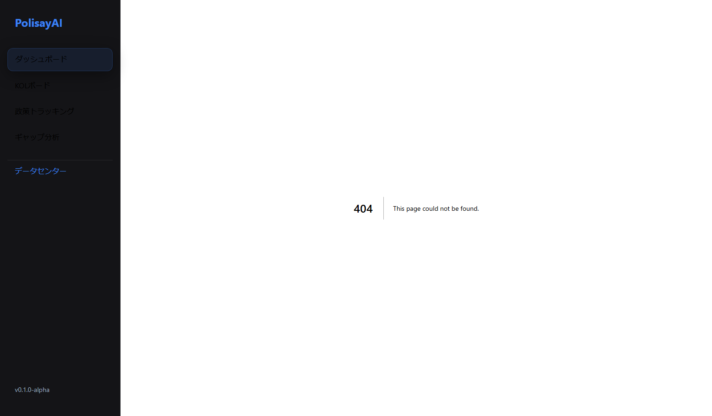

# 🏛️ PolisayAI: Next-Gen Legislative Intelligence Platform

[English](#english) | [日本語](#japanese) | [한국어](#korean)

---



---

<a name="english"></a>
## 🇺🇸 English

PolisayAI is an **intelligent legislative support platform** that analyzes massive amounts of legislative data from the Japanese political scene and the voices of policy beneficiaries to provide precise policy insights.

By analyzing real-time data from the National Diet Library (NDL) API, tracking the influence of Key Opinion Leaders (KOLs), and diagnosing gaps between market demand and legislative supply, we help stakeholders make better decisions.

### ✨ Key Features
*   **📊 Intelligence Dashboard**: Real-time visualization of data collection status and core policy themes (Medical, DX, Economy, etc.).
    <br>
*   **👥 KOL Influence Board**: Analysis of Japanese Diet speakers based on faction, frequency of remarks, and influence metrics.
    <br>
*   **📈 Policy Trend Tracking**: Time-series monitoring of discussion momentum for specific policy topics.
    <br>
*   **🎯 Strategic Gap Analysis**: Diagnostic tool to measure the alignment between social demand and legislative supply.
    <br>
*   **🏗️ Data Center (Admin)**: Multi-source (KR/JP) data collection controller with detailed parameter settings.
    <br>

### 🛠️ Tech Stack
*   **Frontend**: Next.js 16 (App Router), React 19, TypeScript, Lucide React
*   **Visualization**: Recharts (Dynamic SVG Charts)
*   **Database & Backend**: Supabase, Better-SQLite3
*   **AI/Analysis**: Gemini API (Google Generative AI)
*   **Testing**: Playwright (E2E Testing)
*   **DevOps & Deployment**: Docker, Google Cloud Build

---

<a name="japanese"></a>
## 🇯🇵 日本語

PolisayAIは、日本の政界における膨大な立法データと政策受益者の声をAIで分析し、精密な政策インサイトを提供する**知能型立法支援プラットフォーム**です。

国立国会図書館（NDL）APIを通じたリアルタイム・データの収集、KOL（Key Opinion Leaders）の影響力追跡、そして市場の需要と政策供給の間の格差分析を通じて、より良い意思決定を支援します。

### ✨ 主な機能
*   **📊 インテリジェンス・ダッシュボード**: データ収集状況および主要政策テーマ（医療、DX、経済など）のリアルタイム可視化。
    <br>
*   **👥 KOLインフルエンス・ボード**: 日本国会発言者の活動データ、会派、発言回数に基づく影響力分析リストの提供。
    <br>
*   **📈 政策トレンド追跡**: 政策テーマ別の議論の勢いの変化を時系列チャートでモニタリング。
    <br>
*   **🎯 戦略的ギャップ分析**: 社会が求める政策（Demand）と国会で議論される政策密度（Supply）の間の整合性診断と勧告の提供。
    <br>
*   **🏗️ データセンター (Admin)**: 日韓マルチソースデータ収集機のコントロールおよび詳細パラメータ設定機能。
    <br>

### 🛠️ 技術スタック
*   **Frontend**: Next.js 16 (App Router), React 19, TypeScript, Lucide React
*   **Visualization**: Recharts (Dynamic SVG Charts)
*   **Database & Backend**: Supabase, Better-SQLite3
*   **AI/Analysis**: Gemini API (Google Generative AI)
*   **Testing**: Playwright (E2E Testing)
*   **DevOps & Deployment**: Docker, Google Cloud Build

---

<a name="korean"></a>
## 🇰🇷 한국어

PolisayAI는 일본 정계의 방대한 입법 데이터와 정책 수혜자들의 목소리를 AI로 분석하여 정밀한 정책 인사이트를 제공하는 **지능형 입법 지원 플랫폼**입니다.

실시간 데이터 수집(국립국회도서관 API), KOL(Key Opinion Leaders) 영향력 추적, 그리고 시장 수요와 정책 공급 간의 격차 분석을 통해 더 나은 의사결정을 돕습니다.

### ✨ 주요 기능
*   **📊 지능형 대시보드**: 전체 데이터 수집 현황 및 주요 정책 테마(의료, DX, 경제 등)의 실시간 빈도 시각화.
    <br>
*   **👥 KOL 영향력 보드**: 일본 국회 발언자들의 활동 데이터와 파벌, 발언 횟수 기반의 영향력 분석 명단 제공.
    <br>
*   **📈 정책 트렌드 추적**: 정책 주제별 논의 모멘텀 변화를 시계열 차트로 모니터링.
    <br>
*   **🎯 전략적 격차 분석**: 시장이 요구하는 정책(Demand)과 국회에서 논의되는 정책 밀도(Supply) 사이의 정합성 진단 및 권고안 제공.
    <br>
*   **🏗️ 데이터 센터 (Admin)**: 한/일 멀티 소스 데이터 수집기 컨트롤 및 수집 파라미터 상세 설정 기능.
    <br>

### 🛠️ 기술 스택
*   **Frontend**: Next.js 16 (App Router), React 19, TypeScript, Lucide React
*   **Visualization**: Recharts (Dynamic SVG Charts)
*   **Database & Backend**: Supabase, Better-SQLite3
*   **AI/Analysis**: Gemini API (Google Generative AI)
*   **Testing**: Playwright (E2E 테스트)
*   **DevOps & Deployment**: Docker, Google Cloud Build

---

## 🚀 Get Started

1.  **Installation**
    ```bash
    npm install
    ```
2.  **Environment Setup**
    Create a `.env` file and set your `GEMINI_API_KEY`.
3.  **Run Development Server**
    ```bash
    npm run dev
    ```

---
© 2026 PolisayAI Team. Built with ❤️ for Better Governance.
